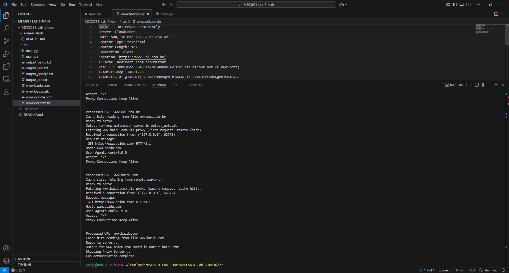

 # MSCS631_Lab_5
Samrat Baral

Lab 5

University of the Cumberlands

2025 Spring - Advanced Computer Networks (MSCS-631-M40) - Full Term
Dr. Yousef Nijim

March 14, 2025

Understanding of web proxy servers working and one of their basic functionalities – caching. Your task is to develop a small web proxy server which is able to cache web pages.

# Screenshot




# Ouput 
```bash
chmod +x main.sh
```

```bash
./main.sh
Starting Proxy Server on 127.0.0.1:8888...
Traceback (most recent call last):
  File "C:\Users\sanjo\Downloads\MSCS631_Lab_5-main\MSCS631_Lab_5-main\src\main.py", line 11, in <module>
    tcpSerSock.bind((sys.argv[1], 8888))
PermissionError: [WinError 10013] An attempt was made to access a socket in a way forbidden by its access permissions
Fetching www.google.com via proxy (first request: remote fetch)...
Received a connection from: ('127.0.0.1', 62662)
Request message:
 GET http://www.google.com/ HTTP/1.1
Host: www.google.com
User-Agent: curl/8.9.0
Accept: */*
Proxy-Connection: Keep-Alive


Processed URL: www.google.com
Cache miss: fetching from remote server...
Ready to serve...
Fetching www.google.com via proxy (second request: cache hit)...
Received a connection from: ('127.0.0.1', 62664)
Request message:
 GET http://www.google.com/ HTTP/1.1
Host: www.google.com
User-Agent: curl/8.9.0
Accept: */*
Proxy-Connection: Keep-Alive


Processed URL: www.google.com
Cache hit: reading from file www.google.com
Ready to serve...
Output for www.google.com saved in output_google.txt
Fetching www.bbc.co.uk via proxy (first request: remote fetch)...
Received a connection from: ('127.0.0.1', 62665)
Request message:
 GET http://www.bbc.co.uk/ HTTP/1.1
Host: www.bbc.co.uk
User-Agent: curl/8.9.0
Accept: */*
Proxy-Connection: Keep-Alive

*
* (more output)
*
Processed URL: www.baidu.com
Cache miss: fetching from remote server...
Ready to serve...
Fetching www.baidu.com via proxy (second request: cache hit)...
Received a connection from: ('127.0.0.1', 62673)
Request message:
 GET http://www.baidu.com/ HTTP/1.1
Host: www.baidu.com
User-Agent: curl/8.9.0
Accept: */*
Proxy-Connection: Keep-Alive


Processed URL: www.baidu.com
Cache hit: reading from file www.baidu.com
Ready to serve...
Output for www.baidu.com saved in output_baidu.txt
Stopping Proxy Server...
Lab demonstration complete.
```
# Experience and Challenges:
- Working on this proxy server lab was a valuable exercise in understanding the fundamentals of network programming and HTTP. I appreciated how the lab required me to handle both caching and live HTTP requests. Implementing the caching mechanism provided insight into how web content can be stored and reused, reducing unnecessary traffic and latency. It was interesting to see the interplay between the client’s request and the server’s response, and to learn how even a simple proxy can play a critical role in network performance and efficiency.

- One of the main challenges I faced was managing the intricacies of socket communication, especially in dealing with the blocking behavior of socket calls and ensuring that data was correctly read and forwarded in chunks. Handling different types of content (text versus binary) also presented a challenge, as the basic implementation is more suited to HTML files than images or other media. These obstacles underscored the importance of robust error handling and thoughtful design when building networked applications—a valuable lesson for any developer working in the field of network programming.
